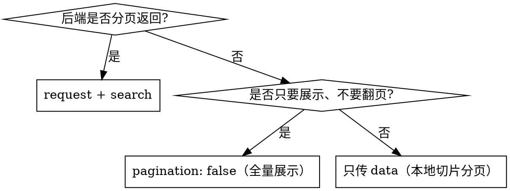

# TmTable 使用指南

`TmTable` 是 `@trustmo/tm-ui` 基于 [vxe-table](https://vxetable.cn/) `vxe-grid` 的薄封装。**表格主体**（列 / 数据 / 排序 / 勾选 / 行编辑）由 vxe 提供，**分页器与搜索表单用 ant-design-vue**，与全 ant 生态视觉一致。

## 心智模型

```
TmTable = VxeGridProps（vxe 原生 props / slots / events 全透传）
        + 3 个公司扩展键：
          ├─ request  → 远程模式：mount 拉首页 + 分页 change 自动 refetch（内建 race 守卫）
          ├─ search   → 声明式 ant 搜索表单(input/select/date) → query 触发拉数，页码重置 1
          └─ density  → 行高档位 compact(36) / default(48) / loose(56)

分页器：ant <a-pagination>（不是 vxe 分页器）。pagerConfig 不再驱动 vxe，
        仅 pageSize / pageSizes 生效，total 由组件内部接管
        （远程 = 服务端返回 total；静态 = 数据长度）。
```

## 何时用

| 场景 | 姿势 |
| --- | --- |
| 列表页/详情页子表，需后端分页排序 | `request` + `search`（+ 可选 `density`） |
| 静态小数据，本地切片分页 | 只传 `data` + `columns`（不传 `request`） |
| 纯展示 / API 属性表，不翻页 | `pagination: false`，数据全量渲染不切片 |
| 勾选 / 行编辑 / 虚拟滚动 / 列拖拽 | vxe 原生能力直接透传（见「进阶透传」） |



## 列模型（最重要：vxe 的 `field`，不是 ant 的 `dataIndex`）

TmTable 列配置是 vxe 的 `VxeColumnProps` 数组，字段名用 **`field`**。照抄 ant 表格的 `dataIndex` 会导致列渲染为空。

```ts
import type { TmTableProps } from '@trustmo/tm-ui'

const columns: TmTableProps['columns'] = [
  { type: 'checkbox', width: 60 },            // vxe 勾选列
  { field: 'id', title: 'ID', width: 80 },
  { field: 'name', title: '姓名' },            // 未设宽度 → fit 铺满容器
  { field: 'status', title: '状态', width: 100, fixed: 'right' },
  { field: 'extra', title: '操作', slots: { default: 'action' } }, // 自定义列插槽（vxe slots）
]
```

常用列字段：`field` / `title` / `width` / `align` / `fixed` / `sortable`（配 `sort-config`）/ `type: 'checkbox'` / `editRender` / `slots`。

## 远程模式（request + search + density）

`request` 是唯一必传的扩展键。返回 `{ data, total }` 写入 vxe-grid 与 ant 分页器；`search` 声明式生成表格上方搜索区，「查询」收集**非空字段**为 `query` 触发拉数（页码重置 1），「重置」清空并重拉。

```ts
// columns.ts
import type { TmTableProps } from '@trustmo/tm-ui'

export const columns: TmTableProps['columns'] = [
  { field: 'id', title: 'ID', width: 80 },
  { field: 'name', title: '姓名' },
  { field: 'status', title: '状态', width: 100 },
]

// 远程拉数：后端分页 + 按 query 过滤
export const request: TmTableProps['request'] = async ({ currentPage, pageSize, query }) => {
  const res = await fetch(
    `/api/users?page=${currentPage}&pageSize=${pageSize}` +
      `&name=${query?.name ?? ''}&status=${query?.status ?? ''}`,
  ).then((r) => r.json())
  return { data: res.list, total: res.total }
}

// ⚠️ search 必须显式标注 TmTableProps['search']，否则 type 被推断成 string 而非字面量联合
export const search: TmTableProps['search'] = {
  fields: [
    { field: 'name', label: '姓名', type: 'input', placeholder: '请输入姓名' },
    {
      field: 'status',
      label: '状态',
      type: 'select',
      options: [
        { label: '启用', value: 1 },
        { label: '禁用', value: 2 },
      ],
    },
  ],
}
```

```vue
<script setup lang="ts">
import { ref } from 'vue'
import { TmTable } from '@trustmo/tm-ui'
import type { TmTableDensity } from '@trustmo/tm-ui'
import { columns, request, search } from './columns'

const density = ref<TmTableDensity>('default')
</script>

<template>
  <tm-table :request="request" :columns="columns" :search="search" :density="density" />
</template>
```

## 静态 / 纯展示

不传 `request` 时 TmTable 退化为静态表格：`data` 本地切片渲染当前页，翻页不请求任何接口。

```vue
<!-- 静态分页：total = data.length -->
<tm-table :data="rows" :columns="columns" />

<!-- 纯展示不翻页（API 属性表等）：pagination: false 全量渲染不切片 -->
<tm-table :data="rows" :columns="columns" :pagination="false" />
```

## 进阶透传（vxe 原生能力）

TmTable 透传 vxe-grid 全部 props / slots / events，进阶能力零适配直接可用。

### 勾选

`columns` 里加 `{ type: 'checkbox', width: 60 }` 勾选列，配 `checkbox-config`，通过 `ref` 调 `getCheckboxRecords()`（`ref` 类型为 `VxeGridInstance`）。

```vue
<script setup lang="ts">
import { ref } from 'vue'
import { TmTable } from '@trustmo/tm-ui'
import type { TmTableProps, VxeGridInstance } from '@trustmo/tm-ui'

const tableRef = ref<VxeGridInstance>()
const columns: TmTableProps['columns'] = [
  { type: 'checkbox', width: 60 },
  { field: 'id', title: 'ID', width: 80 },
  { field: 'name', title: '姓名' },
]

const showChecked = () => {
  const records = tableRef.value?.getCheckboxRecords() ?? []
  console.log('勾选行：', records)
}
</script>

<template>
  <tm-table ref="tableRef" :data="rows" :columns="columns" :checkbox-config="{ highlight: true }" />
</template>
```

### 行编辑

列 `editRender` 声明编辑器（用 vxe-pc-ui 的 `VxeInput` 等），配 `edit-config` 触发方式。**需 vxe-pc-ui 运行时已注册**（业务侧 `app.use(VxeUI)`）。

```ts
const columns: TmTableProps['columns'] = [
  { field: 'id', title: 'ID', width: 80 },
  { field: 'name', title: '姓名（点击编辑）', editRender: { name: 'VxeInput' } },
  { field: 'age', title: '年龄', editRender: { name: 'VxeInput', props: { type: 'integer' } } },
]

const editConfig: TmTableProps['editConfig'] = {
  trigger: 'click',    // 点击进入编辑
  mode: 'row',         // 整行编辑
  showStatus: true,    // 显示增删改状态
}
```

### 实例方法（ref 透传）

`ref` 是 `VxeGridInstance`，方法保真转发（非 spread Proxy），可直接调用：

```ts
revertData()                    // 数据回滚
clearData() / updateData(data)  // 清空 / 覆盖更新
getCheckboxRecords()            // 获取勾选行
loadColumn(columns) / loadData(data)  // 动态加载列 / 数据
getRecordset() / undo() / redo()      // 编辑记录集 / 撤销 / 重做
commitProxy(code)               // vxe 工具栏「保存」触发提交代理
```

### 插槽 / 事件

vxe-grid 的 slots（`empty` / `toolbar` / `top` / `bottom` / `form` / 列自定义 `slots`）与 events 全量透传，直接用原生名字即可。

## 公司默认值

`tmTableDefaults`（业务显式传同名 prop 即覆盖）：

| 键 | 默认值 |
| --- | --- |
| `border` | `true` 整表边框 |
| `stripe` | `true` 斑马纹 |
| `showOverflow` | `true` 超长内容 tooltip 省略 |
| `fit` | `true` 列宽铺满容器 |
| `pagination` | `true` 渲染 ant 分页器 |
| `pagerConfig` | `{ pageSize: 10, pageSizes: [10, 20, 50] }`（驱动 ant Pagination） |

## 类型清单

```ts
import type {
  TmTableProps,        // VxeGridProps & TmTableExtProps；泛型 T = 行数据类型
  TmTableExtProps,     // { request? / search? / density? / pagination? }
  TmTablePageParam,    // { currentPage: number; pageSize: number }
  TmTableResult,       // { data: T[]; total: number }，request 返回值
  TmTableSearchConfig, // { fields: TmTableSearchField[] }
  TmTableSearchField,  // { field; label; type?: 'input'|'select'|'date'; options?; span? }
  TmTableDensity,      // 'compact' | 'default' | 'loose'
  VxeGridProps,        // vxe 原生 props 类型（含 columns / data / height / row-config / checkbox-config / edit-config）
  VxeGridInstance,     // ref 实例类型（getCheckboxRecords 等）
  VxeColumnProps,      // 单列类型
  VxeGridListeners,    // vxe 原生事件类型
} from '@trustmo/tm-ui'
// 或按需子入口：import type { TmTableProps } from '@trustmo/tm-ui/table'
```

## 常见坑

1. **列字段名用 `field`**：TmTable 是 vxe 列模型，ant 的 `dataIndex` 不识别，照抄会渲染为空。
2. **search 需显式类型标注**：`const search: TmTableProps['search'] = {...}`，否则 `type: 'input'` 被推断成 `string`，模板里 `(field.type ?? 'input') === 'input'` 的类型收窄失效。
3. **pagerConfig 不再驱动 vxe**：`pagerConfig.total` 由组件内部接管，业务**不要**手动维护 total；分页事件也由 ant Pagination change 内部驱动，业务无需监听 vxe `page-change`。
4. **vxe 运行时依赖**：需业务侧 `app.use(VxeTable)` + `app.use(VxeUI)`，且引入 `vxe-pc-ui/lib/style.css` + `vxe-table/lib/style.css`，否则表格/编辑无样式。vxe-pc-ui 未注册时行编辑不生效。
5. **density vs row-config**：业务显式传 `row-config.height` 优先于 `density`。
6. **height 传 `'100%'` 撑满父容器**：业务显式传 `height`；不传则按内容自然高度，宽度始终铺满。

## BREAKING（旧版 v1 → v2）

- **列模型**：旧 ant 风格 `dataIndex` → **vxe `field`**（迁移需改名）。
- **分页器**：vxe 内置 `pagerConfig` → **ant Pagination**；`total` 内部接管，删除手动维护的 `pagerConfig.total` 与 vxe `page-change` 监听。
- **静态切片**：语义不变，仍是不传 `request` 时本地切片；纯展示用 `pagination: false`。